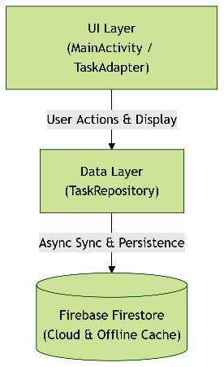
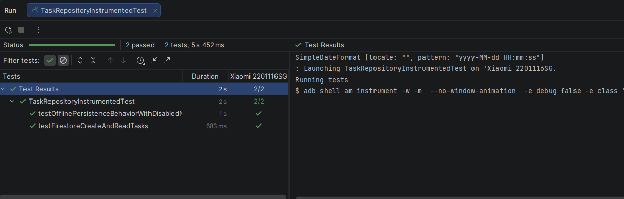
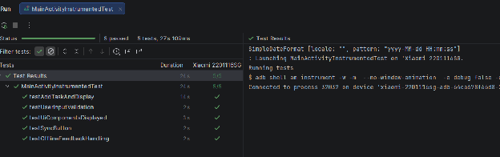
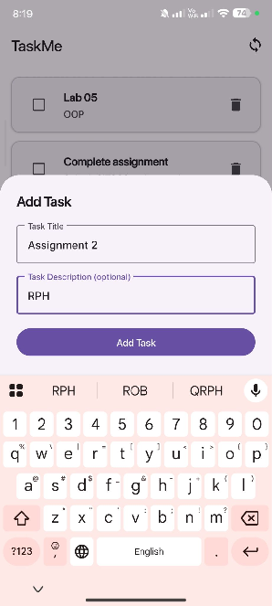
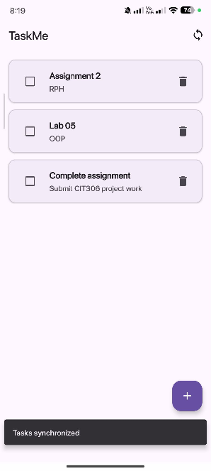
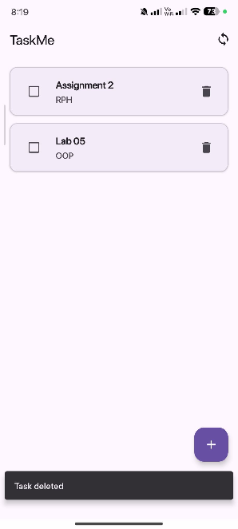
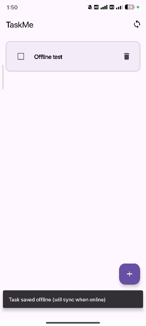
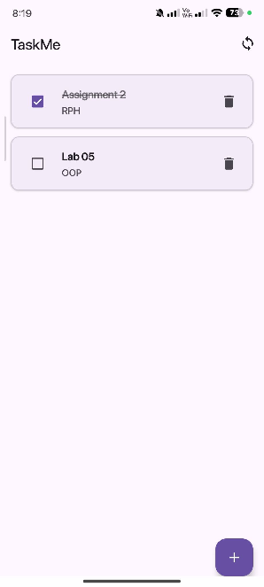

# TaskMe - A Simple To-Do List Android Application

## Overview and System Architecture



TaskMe is an Android task management application designed to allow users to create, view, complete, delete, and synchronize task items. It features a modern, accessible Material Design 3 user interface with smooth animations and robust offline capability powered by Firebase Firestore.

* **Backend & Persistence:** Firebase Firestore (Cloud Database with local disk caching and offline persistence)  
* **Testing:** JUnit 4, Espresso, AndroidX Test Runner, ActivityScenarioRule

## Codebase Directory Structure

```
TaskMe/
├── app/src/main/
│   ├── AndroidManifest.xml
│   ├── java/com/example/taskme/
│   │   ├── MainActivity.java                 # UI Controller & Event Handler
│   │   ├── adapter/
│   │   │   └── TaskAdapter.java
│   │   ├── data/
│   │   │   ├── TaskContract.java
│   │   │   └── TaskRepository.java           # Firestore CRUD Operations
│   │   └── model/
│   │       └── TaskItem.java                 # Task Data Model
│   └── res/
│       ├── layout/
│       │   ├── activity_main.xml
│       │   ├── dialog_add_task.xml
│       │   └── item_task.xml
│       ├── menu/
│       │   └── top_app_bar_menu.xml
│       └── values/
│           └── strings.xml
├── app/src/test/
│   └── java/com/example/taskme/
│       └── TaskItemUnitTest.java
└── app/src/androidTest/
    └── java/com/example/taskme/
        ├── MainActivityInstrumentedTest.java      # UI Espresso Tests
        └── TaskRepositoryInstrumentedTest.java
```

## Core Features

1. **Task Creation:** Modal bottom sheet form for adding new tasks with required title and optional description fields.
2. **Task List Display & Management:** Interactive RecyclerView presenting tasks sorted by creation timestamp, complete with entrance animations.
3. **Completion Toggle:** Checkbox toggle to mark tasks as completed or pending, applying dynamic strikethrough styling and updating database state.
4. **Task Deletion:** Instant task removal from the database with animated list updates and confirmation feedback.
5. **Cloud Sync & Offline Support:** Automatic background synchronization with Firebase Firestore and seamless offline operation using local disk cache.
6. **Network Monitoring & Empty States:** Live network status detection, user feedback via colored Snackbars, and a visual empty state screen when no tasks exist.

## User Guide

* **Launch**: Tasks load automatically on startup, sorted by date. An empty state prompts users if no tasks exist.  
* **Add Task**: Tap the **+** button, enter a title (required) and optional description, then tap **Add Task**.  
* **Complete Task**: Tap the **Checkbox** to toggle status; completed tasks are struck through.  
* **Delete Task**: Tap the **Trash Icon** on any task card to remove it instantly.  
* **Offline/Sync**: Work continues seamlessly without internet; changes sync automatically once reconnected. Tap the **Sync Icon** to manually verify connectivity and refresh data.

## System Logic and Architecture

### Fault Tolerance & Error Handling

TaskMe provides the resiliency of the application, and it is constantly checking on the availability of the network and incorporating defensive error handling. MainActivity fetches connectivity status on the network and uses cached offline data if it is not connected to the network and provides a Snackbar message to the user when it is not connected to the network. Asynchronous database requests can be handled through TaskRepository, which is based on a TaskCallback interface for separating the success and failure paths. If the operation fails, the application will catch the exception, log the exception information so as to be able to debug, and show the error information in a user friendly way. Moreover, if the network request fails when the app updates its task list, the app will immediately restore the original task list from local storage, which will set the UI back to its last known good state.

### Data Persistence

Cloud Firestore stores data in the cloud, and TaskRepository uses the local disk to cache the data. All task items are stored in the collection named "tasks" with an identifier provided by the TaskContract constants. Pending actions, such as adding or deleting tasks, are stored locally in the Firestore disk cache and synced automatically with the cloud when the network is re-established.

### Business Logic

The input validations, ordering the lists and synchronizing with the UI are all governed by the core business logic. MainActivity validates the user's input before adding a task to ensure that the task's title is not null and an inline error message is displayed on the field if it is null. When tasks are created, they are given a creationTimestamp when they are created in Firestore and returned in descending order of creationTimestamp. The UI styling logic dynamically applies the strike-through formatting when the task is completed, and automatically switches between the prompt for an empty UI state and the task list, when there are actual tasks present.

## Unit Testing and Instrumental Testing

| Test Method | Purpose & Description |
| :---- | :---- |
| `testTaskItemCreationAndGettersSetters()` | Verifies object instantiation, getter/setter data integrity, and `isCompleted` boolean state mutation. |
| `testTaskContractConstants()` | Ensures database contract constants (`COLLECTION_TASKS`, `FIELD_TITLE`, etc.) match expected Firestore schema keys. |
| `testFirestoreCreateAndReadTasks()` | Verifies live Firebase Firestore CRUD integration by creating a task, reading collection tasks, asserting presence, and cleaning up. |
| `testOfflinePersistenceBehaviorWithDisabledNetwork()` | Tests offline queued write capability by disabling Firestore network, writing a task, and ensuring callback synchronization upon re-enabling network. |
| `testUiComponentsDisplayed()` | Verifies main view components (FAB, TopAppBar, RecyclerView / TextEmptyState) render correctly on startup. |
| `testUserInputValidation()` | Tests modal form validation when attempting to create a task with an empty title, ensuring error message display and modal persistence. |
| `testAddTaskAndDisplay()` | Simulates full end-to-end user workflow: opening modal, filling inputs, submitting, and confirming task card appearance in RecyclerView. |
| `testSyncButton()` | Verifies top app bar sync button click handler and list refresh behavior. |
| `testOfflineFeedbackHandling()` | Simulates network disruption via `disableNetwork()`, triggers sync action, and verifies graceful offline user feedback. |

### Running the tests

  


## App Exhibit

| Adding a Task | Added task is displayed |
| :---: | :---: |
|  |  |

| Manual task sync via sync button | Delete task |
| :---: | :---: |
|  |  |

| Adding task while offline (no internet) | Completing a task |
| :---: | :---: |
|  |  |
